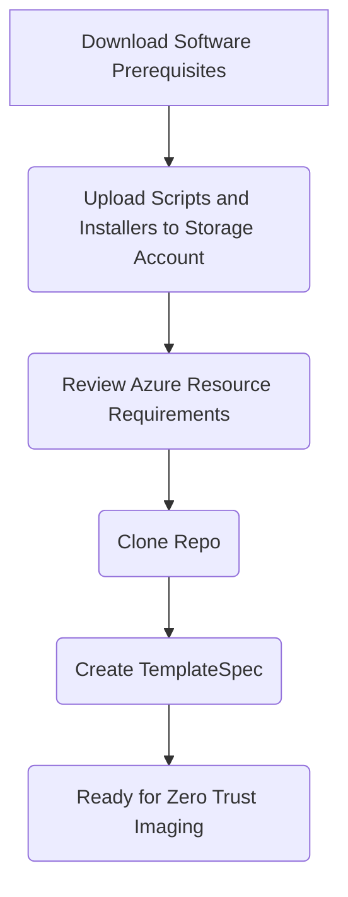
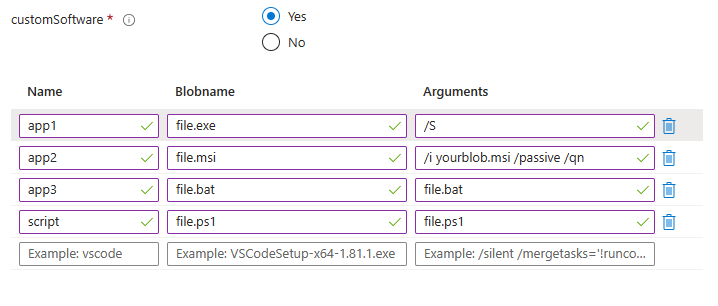

# Zero Trust and Azure Imaging

This zero trust imaging solution for Azure allows you create images in an Azure environment that adheres to zero trust. While other options exist in Azure, its either a manual process or it doesn't adhere to zero trust. Azure Image Builder (AIB) is a great imaging service in Azure but does not adhere to zero trust. The service creates a staging resource group with a storage account that cannot be configured with a private endpoint.  This breaks the zero trust principles. This solution uses a storage account with a private endpoint to store applications and the existing, preconfigured resources that comply with the principles.



## Prequisites

### Software

* [Azure Bicep](https://learn.microsoft.com/en-us/azure/azure-resource-manager/bicep/overview?tabs=bicep)
* [Azure PowerShell Modules](https://learn.microsoft.com/en-us/powershell/azure/install-azure-powershell?view=azps-10.2.0)

### Upload the following scripts and files to your storage account container

* [Scripts](https://github.com/mikedzikowski/ZTAImage/tree/main/ImageCustomizationScripts)
* [Az.Accounts 2.12.1 PowerShell Module](https://www.powershellgallery.com/api/v2/package/Az.Accounts/2.12.1)
* [Az.Compute 5.7.0 PowerShell Module](https://www.powershellgallery.com/api/v2/package/Az.Compute/5.7.0)
* [Az.Resources 6.6.0 PowerShell Module](https://www.powershellgallery.com/api/v2/package/Az.Resources/6.6.0)
* [vDot Installers](https://github.com/The-Virtual-Desktop-Team/Virtual-Desktop-Optimization-Tool/archive/refs/heads/main.zip)
* [Teams Installer - Commercial](https://teams.microsoft.com/downloads/desktopurl?env=production&plat=windows&arch=x64&managedInstaller=true&download=true)
* [Teams Installer - DoD](https://dod.teams.microsoft.us/downloads/desktopurl?env=production&plat=windows&arch=x64&managedInstaller=true&download=true)
* [Teams Installer - GCC](https://teams.microsoft.com/downloads/desktopurl?env=production&plat=windows&arch=x64&managedInstaller=true&ring=general_gcc&download=true)
* [Teams Installer - GCCH](https://gov.teams.microsoft.us/downloads/desktopurl?env=production&plat=windows&arch=x64&managedInstaller=true&download=true)
* [Microsoft Visual C++ Redistributable](https://aka.ms/vs/16/release/vc_redist.x64.exe)
* [Remote Desktop WebRTC Redirector Service](https://aka.ms/msrdcwebrtcsvc/msi)

### Example Custom Installers



### Existing Azure Resources

The following resources must exist in your Azure environment before deployment:

* Virtual Network
* Storage Account
  * Private Endpoint
  * Private DNS Zone
  * Blob container with executables, scripts, etc. that are required for the imaging deployment

## Creating Template Spec

### Example

```powershell
New-AzTemplateSpec `
    -Name 'ZeroTrustImaging' `
    -ResourceGroupName rg-image-usgovvirginia-01 `
    -Version '1.0' `
    -Location usgovvirginia `
    -DisplayName "Zero Trust Image Template" `
    -TemplateFile '.\solution.json' `
    -UIFormDefinitionFile '.\uiDefinition.json'  `
    -Force
```

### Parameters

#### -AdminUsername

Specifies the local administrator user name of the virtual machine that will be captured.

```yaml
Type: String
```

#### -ContainerName

Specifies the container name where files, and scripts will be uploaded and consumed during the image process.

```yaml
Type: String
```

#### -GalleryName

Specifies the existing Azure Image Gallery where the image will be created.

```yaml
Type: String
```

#### -ImageName

Specifies the name of the image that will created.

```yaml
Type: String
```

#### -ImageOffer

Specifies the name of the image offer of the image that will be created.

```yaml
Type: String
```

#### -ImagePublisher

Specifies the name of the image publisher of the image that will be created.

```yaml
Type: String
```

#### -ImageSku

Specifies the name of the image SKU of the image that will be created.

```yaml
Type: String
```

#### -ImageVersion

Specifies the name of the image version of the image that will be created.

```yaml
Type: String
```

#### -InstallAccess

Specifies if Access will be installed on the image created.

```yaml
Type: Boolean
```

#### -InstallExcel

Specifies if Excel will be installed on the image created.

```yaml
Type: Boolean
```

#### -InstallFsLogix

Specifies if FsLogix will be installed on the image created.

```yaml
Type: Boolean
```

#### -InstallOneDriveForBusiness

Specifies if OneDrive For Business will be installed on the image created.

```yaml
Type: Boolean
```

#### -InstallOneNote

Specifies if OneNote will be installed on the image created.

```yaml
Type: Boolean
```

#### -InstallPowerPoint

Specifies if PowerPoint will be installed on the image created.

```yaml
Type: Boolean
```

#### -InstallPublisher

Specifies if Publisher will be installed on the image created.

```yaml
Type: Boolean
```

#### -InstallTeams

Specifies if Teams will be installed on the image created.

```yaml
Type: Boolean
```

#### -InstallVirtualDesktopOptimizationTool

Specifies if Virtual Desktop Optimization Tool (VDOT) will be installed on the image created.

```yaml
Type: Boolean
```

#### -InstallVisio

Specifies if Visio will be installed on the image created.

```yaml
Type: Boolean
```

#### -InstallWord

Specifies if Word will be installed on the image created.

```yaml
Type: Boolean
```

#### -Location

Specifies a location for the resources of the solution to be deployed.

```yaml
Type: String
```

#### -MiName

Specifies the name of an existing managed identity to be used during deployment of the solution.

```yaml
Type: String
```

#### -OSVersion

Specifies the OS Version of the image to be captured.

```yaml
Type: String
```

#### -ResourceGroupName

Specifies the name of the resource group to create resources.

```yaml
Type: String
```

#### -SecurityType

Specifies the security type of the image to be captured.

```yaml
Type: String
```

#### -StorageAccountName

Specifies the name of the storage account where assets will be downloaded from and used during the image process.

```yaml
Type: String
```

#### -StorageEndpoint

Specifies the storage endpoint of the target storage account.

```yaml
Type: String
```

#### -SubnetName

Specifies the subnet of the virtual network to be used during the image process.

```yaml
Type: String
```

#### -TenantType

Specifies the tenant type used in the target environment.

```yaml
Type: String
AllowedValues: 'Commercial', 'DepartmentOfDefense','GovernmentCommunityCloud','GovernmentCommunityCloudHigh'
```

#### -UserAssignedIdentityObjectId

Specifies the object ID of the managed identity used during deployment.

```yaml
Type: String
```

#### -VirtualNetworkName

Specifies the virtual network name of the vNet used during the image process.

```yaml
Type: String
```

#### -VmName

Specifies the name of the virtual machine to be captuired.

```yaml
Type: String
```

#### -VmSize

Specifies the  size of the the virtual machine to be captuired.

```yaml
Type: String
```

### Adding Applications

* Add additional applications by adding addtional blocks of installers in module image.bicep
* Any blob called will have to be uploaded to the storage account and container that are defined in the parameter set
* Using the enabled argument will allow the installer to be modular and flexible during image creation

```bicep
var installers = [
    {
        name: 'myapp1'
        blobName: 'software1.exe'
        arguments: '/S'
        enabled: true
    }
    {
        name: 'myapp2'
        blobName: 'software2.exe'
        arguments: '/S'
        enabled: false
    }
]
```

### View Run Command Status

The applications are installed using the Run Command extension on the Azure virtual machine.  To the view and troubleshoot the status of a Run Command use the example below:

``` powershell
PS C:\git\ztaimage> $x = Get-AzVMRunCommand -ResourceGroupName rg-image -VMName vm-image -RunCommandName office -Expand InstanceView
PS C:\git\ztaimage> $x.InstanceView


ExecutionState   : Running
ExecutionMessage :
ExitCode         : 0
Output           :
Error            :
StartTime        : 8/2/2023 2:14:27 PM
EndTime          :
Statuses         :
```
